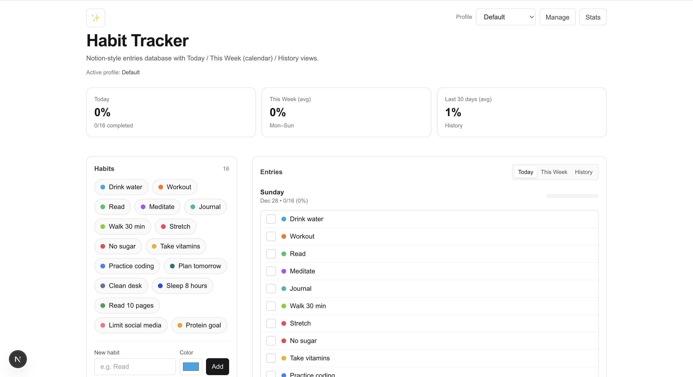
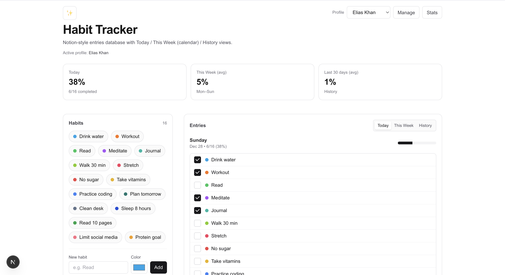
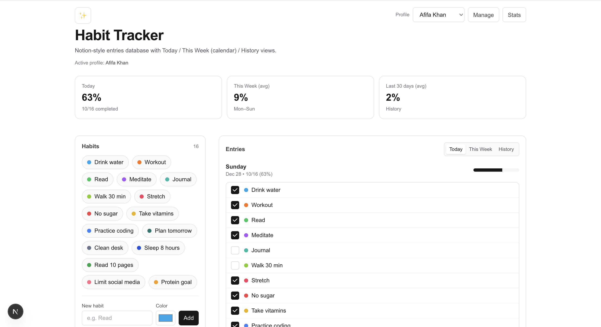
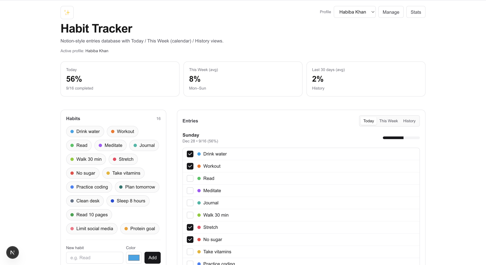
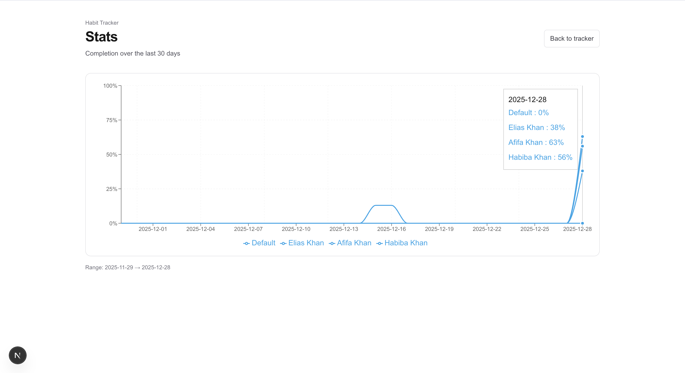

# Habit Tracker

A local-first habit tracker built with **Next.js (App Router)** + **Prisma (SQLite)**.

The app supports **multiple local profiles** (no login) so each profile can maintain its own habits + check-ins, while the **Stats** view shows a **distinct line per profile**.

## Key features
- **Notion-style tracker UI** with Entries views:
  - **Today** (checklist)
  - **This Week** (calendar picker + checklist)
  - **History** (last 30 days)
- **Profiles (local-only)**
  - Create/switch profiles
  - Each profile has its own habits + check-ins
  - New profiles automatically **inherit the currently active profile’s habit set**
- **Stats dashboard**
  - 30-day completion chart
  - **One line per profile** with a distinct color palette
- **Local-first persistence**
  - SQLite database stored in `dev.db`
  - Prisma migrations are tracked in `prisma/migrations`

## Tech stack
- Next.js (App Router) + React
- TypeScript
- Prisma + SQLite
- Tailwind CSS
- Zod (request validation)
- Recharts (charts)

## Requirements
- Node.js 18+
- npm

## Getting started
Install dependencies:
```bash
npm install
```

Set up / migrate the database (creates `dev.db` if needed, applies migrations, generates Prisma Client):
```bash
npm run prisma:migrate
```

Seed sample data (creates a default profile + default habits if missing):
```bash
npm run seed
```

Run the dev server:
```bash
npm run dev
```

Open `http://localhost:3000`.

## Screenshots
Add screenshots to `public/screenshots/` and reference them here.

- Home (Today / This Week / History):

  

- Profiles:

  
  
  

- Stats (multi-profile chart):

  

## Profiles
- Switch profiles from the **Profile** dropdown on the home page.
- Manage profiles at:
  - `http://localhost:3000/profiles`

Notes:
- Profiles are **local-only** (no authentication).
- The active profile is stored in an httpOnly cookie.

## Stats
- Visit:
  - `http://localhost:3000/stats`
- The chart shows a **separate series per profile**.

## Common commands
```bash
npm run dev         # start dev server
npm run build       # production build
npm run start       # run production server
npm run lint        # eslint
npm run typecheck   # tsc --noEmit
npm run prisma:studio
npm run seed
```

## Project structure (high level)
- `src/app/` — routes (UI + route handlers)
  - `src/app/api/*` — internal API used by the UI
  - `src/app/profiles/` — profiles management page
  - `src/app/stats/` — stats page (multi-profile chart)
- `src/components/` — UI components (tracker + charts)
- `src/lib/` — shared utilities (Prisma client, active profile helper, date helpers)
- `prisma/` — Prisma schema, migrations, seed

## API overview (internal)
Habits (scoped to the **active profile**):
- `GET /api/habits?date=YYYY-MM-DD`
- `POST /api/habits`
- `PATCH /api/habits/:id`
- `DELETE /api/habits/:id`
- `POST /api/habits/:id/checkins`

Profiles:
- `GET /api/users`
- `POST /api/users`
- `DELETE /api/users/:id`
- `POST /api/users/active` (sets active profile cookie)

## Data & date conventions
- Data lives in SQLite (`dev.db`).
- Dates are treated as **UTC days** (`YYYY-MM-DD`) to keep “daily” check-ins consistent.

## Resetting local data
If you want a clean DB:
1) Delete `dev.db` (and/or `prisma/dev.db` if present)
2) Re-run:
```bash
npm run prisma:migrate
npm run seed
```
